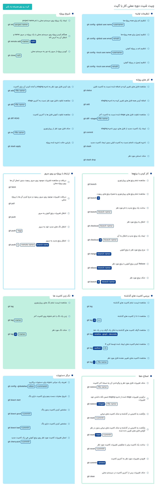

# GIT CheetSheet

***
# GIT by Jadi

- Converting a directory to Git repository using: **<code>git init</code>**
- Knowing the current status in the git: **<code>git status</code>**
- Adding all changed files to staging area: **<code>git add .</code> or <code>git add -A</code>**
- Accepting all changes and transfer it to local or remote repository: **<code>git commit -a -m "message"</code>**
- See commit history: **<code>git log</code>**
- See differences between head & your changes: **<code>git diff head</code>**
- See differences between head & your changes in stage are: **<code>git diff --staged</code>**
- return from stages to modifing area=== stage undo: **<code>git reset filename</code>**
- undo changes of specific file== modifing undo: **<code>git checkout -- filename</code>**
- See available branches and your current branch: **<code>git branch</code>**
- Create new branch in GIT: **<code>git branch branch-name</code>**
- Changing head or transfering between branches: **<code>git checkout branch-name</code>**
- Merging  example branch with main (**you should checkout at main first**) : **<code>git merge branch-name</code>**
- Deleting old branches after merge: **<code>git branch -d branch-name</code>**
- Deleting file using GIT: **<code>git rm filename</code>**
- Adding new remote repository: **<code>git remote add [name] [url]</code>**
- Getting and **knowing** latest changes from remote repository and **NOT Merging** them with local repository: **<code>git fetch</code>**
- Getting latest changes from remote repository and **Merging** them with local repository: **<code>git pull</code>** or **<code>git pull origin branch-name</code>**
- Transfering latest changes from local repository to remote repository: **<code>git push -u origin branch-name</code>** -u flage will be used for the first time and git will remember to push your <code>branch-name</code> to <code>origin</code> and you can simply write <code>git push</code> after that :)
- 

***
## **Workflow of GIT**

***

***
## **What is head in GIT**

##### **head is last your commit!**

***

**<code>git fetch</code>** vs **<code>git pull</code>**

