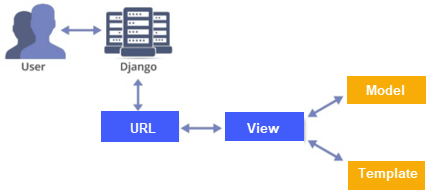

# Course #1 -> Installation 
### Installing Django in Linux

**installing python & virtual env**
<pre><code>sudo apt install python3-pip virtualenv -y</code></pre>

**create virtual env directory**
<pre><code>mkdir django</code></pre>
<pre><code>cd django</code></pre>

**create virtual environment**
<pre><code>virtualenv -p python3 Django_env</code></pre>

**Activate & Deactivate the Virtual envirornment**
<pre><code>source Django_env/bin/activate</code></pre>

You can use <code>deactivate</code> to exit from an environment :)

**Installing Django**
<pre><code>pip install django</code></pre>

##### Creating a Django Project:
type <code>django-admin</code> to see available options

after that:
<pre><code>django-admin startproject projectname</code></pre>

<pre><code>ls</code></pre>

Now, You can see the <code>projectname</code> folder has been add to the directory
<pre><code>ls projectname</code></pre>
<pre><code>tree projectname</code></pre>
<pre><code>cd projectname</code></pre>

type <code>./manage.py</code> or <code>python3 ./manage.py</code> to see available options

after that:
<pre><code>./manage.py runserver</code></pre>

Then, You will recive a local host port that your project have been deployed on it. click on the local project to see yor project!

**Some cool stuff:**

You can see some warnings regarding **migration** ----> Try This:

<pre><code>./manage.py migrate</code></pre>

Then, try <code>ls</code> to see a database file has been added <code>db.sqlite3</code>

after that:
<pre><code>./manage.py createsuperuser</code></pre>


finally:
<pre><code>./manage.py runserver</code></pre>

And you will see the warning will be gone :)

Now you can add <code>admin</code> at the end of the local host link and see the beautiful admin panel that **Django** created for you! 

### Installing Django in Windows

**Create a virtual conda environment**

<pre><code>conda create --name django --clone base</code></pre>

**Installing Django**
<pre><code>pip install django</code></pre>

**Repeat the above Hello World**

***

# Course #2 -> Your First View in Djnago!

<br></br>




### Creating a application for blog:

**✔** Each application should be responsible for one APP and do this App in the best way for instances:
- one application for payment
- one application for map
- one application for category

**✔** The advantages of this method is that you can use these applications in other project!

Now, let's create an application called **blog**:

- Activate your virtual env
<pre><code>python ./manage.py startapp blog</code></pre>
- Use <code>ls</code> to see the application directoy added 😊
- Use <code>tree</code> to see the directory of **blog** application ✋
```
|-- blog
|   |-- __init__.py
|   |-- admin.py
|   |-- apps.py
|   |-- migrations
|   |   `-- __init__.py
|   |-- models.py
|   |-- tests.py
|   `-- views.py
|-- db.sqlite3
|-- manage.py
`-- tmp_project
    |-- __init__.py
    |-- __pycache__
    |   |-- __init__.cpython-38.pyc
    |   |-- settings.cpython-38.pyc
    |   |-- urls.cpython-38.pyc
    |   `-- wsgi.cpython-38.pyc
    |-- asgi.py
    |-- settings.py
    |-- urls.py
    `-- wsgi.py
```

- After that go to <code>settings.py</code> in <code>tmp_project</code> directory and add you **blog** application in the following:

```
INSTALLED_APPS = [
    "django.contrib.admin",
    "django.contrib.auth",
    "django.contrib.contenttypes",
    "django.contrib.sessions",
    "django.contrib.messages",
    "django.contrib.staticfiles",
    "blog.apps.BlogConfig" <------> **Here**
]
```

- Next step is to create view in <code>views.py</code> and add that view to <code>urls.py</code>

**<code>view.py</code>**:
```
from django.shortcuts import render
from django.http import HttpResponse <------> **I add it**

# Create your views here.
def home(request):
  return HttpResponse("Hello, World! Hello, Django!") <------> **I add it**
```

**<code>urls.py</code>**:
```
from django.contrib import admin
from django.urls import path
from blog.views import home <------> **I add it**

urlpatterns = [
    path("admin/", admin.site.urls),
    path("", home) <------> **I add it**
]
```

Then, run <code>python ./manage.py runserver</code> to see your view :)

***

# Course #3 -> Continue to View, Json & More!


