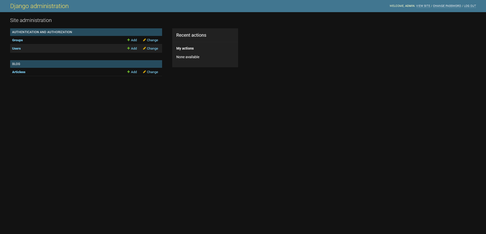
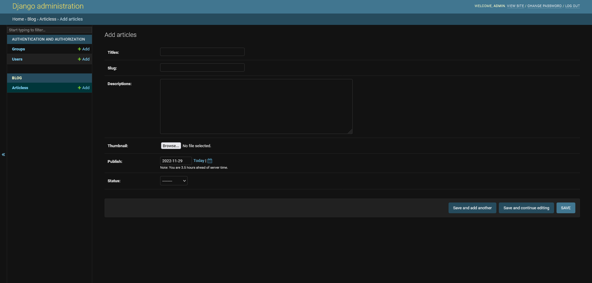

# Course #1 -> Installation 
### Installing Django in Linux

**installing python & virtual env**
<pre><code>sudo apt install python3-pip virtualenv -y</code></pre>

**create virtual env directory**
<pre><code>mkdir django</code></pre>
<pre><code>cd django</code></pre>

**create virtual environment**
<pre><code>virtualenv -p python3 Django_env</code></pre>

**Activate & Deactivate the Virtual envirornment**
<pre><code>source Django_env/bin/activate</code></pre>

You can use <code>deactivate</code> to exit from an environment :)

**Installing Django**
<pre><code>pip install django</code></pre>

##### Creating a Django Project:
type <code>django-admin</code> to see available options

after that:
<pre><code>django-admin startproject projectname</code></pre>

<pre><code>ls</code></pre>

Now, You can see the <code>projectname</code> folder has been add to the directory
<pre><code>ls projectname</code></pre>
<pre><code>tree projectname</code></pre>
<pre><code>cd projectname</code></pre>

type <code>./manage.py</code> or <code>python3 ./manage.py</code> to see available options

after that:
<pre><code>./manage.py runserver</code></pre>

Then, You will recive a local host port that your project have been deployed on it. click on the local project to see yor project!

**Some cool stuff:**

You can see some warnings regarding **migration** ----> Try This:

<pre><code>./manage.py migrate</code></pre>

Then, try <code>ls</code> to see a database file has been added <code>db.sqlite3</code>

after that:
<pre><code>./manage.py createsuperuser</code></pre>


finally:
<pre><code>./manage.py runserver</code></pre>

And you will see the warning will be gone :)

Now you can add <code>admin</code> at the end of the local host link and see the beautiful admin panel that **Django** created for you! 

### Installing Django in Windows

**Create a virtual conda environment**

<pre><code>conda create --name django --clone base</code></pre>

**Installing Django**
<pre><code>pip install django</code></pre>

**Repeat the above Hello World**

***

# Course #2 -> Your First View in Djnago!

<br></br>


### Creating a application for blog:

**✔** Each application should be responsible for one APP and do this App in the best way for instances:
- one application for payment
- one application for map
- one application for category

**✔** The advantages of this method is that you can use these applications in other project!

Now, let's create an application called **blog**:

- Activate your virtual env
<pre><code>python ./manage.py startapp blog</code></pre>
- Use <code>ls</code> to see the application directoy added 😊
- Use <code>tree</code> to see the directory of **blog** application ✋
```
|-- blog
|   |-- __init__.py
|   |-- admin.py
|   |-- apps.py
|   |-- migrations
|   |   `-- __init__.py
|   |-- models.py
|   |-- tests.py
|   `-- views.py
|-- db.sqlite3
|-- manage.py
`-- tmp_project
    |-- __init__.py
    |-- __pycache__
    |   |-- __init__.cpython-38.pyc
    |   |-- settings.cpython-38.pyc
    |   |-- urls.cpython-38.pyc
    |   `-- wsgi.cpython-38.pyc
    |-- asgi.py
    |-- settings.py
    |-- urls.py
    `-- wsgi.py
```

- After that go to <code>settings.py</code> in <code>tmp_project</code> directory and add you **blog** application in the following:

```
INSTALLED_APPS = [
    "django.contrib.admin",
    "django.contrib.auth",
    "django.contrib.contenttypes",
    "django.contrib.sessions",
    "django.contrib.messages",
    "django.contrib.staticfiles",
    "blog.apps.BlogConfig" <------> **Here**
]
```

- Next step is to create view in <code>views.py</code> and add that view to <code>urls.py</code>

**<code>view.py</code>**:
```
from django.shortcuts import render
from django.http import HttpResponse <------> **I add it**

# Create your views here.
def home(request):
  return HttpResponse("Hello, World! Hello, Django!") <------> **I add it**
```

**<code>urls.py</code>**:
```
from django.contrib import admin
from django.urls import path
from blog.views import home <------> **I add it**

urlpatterns = [
    path("admin/", admin.site.urls),
    path("", home) <------> **I add it**
]
```

Then, run <code>python ./manage.py runserver</code> to see your view :)

***

# Course #3 -> Continue to View, Json & More!

We want to add seperate urls for each applicaion:

- First, create <code>urls.py</code> in your application folder (etc: <code>blog</code>)

```
from django.urls import path
from .views import home

urlpatterns = [
    path("", home)
]
```
- Second, in <code>urls.py</code> in your project folder (etc: <code>tmp_project</code>):

```
from django.contrib import admin
from django.urls import path, include <------> **I add it**

urlpatterns = [
    path("admin/", admin.site.urls),
    path("", include('blog.urls')) <------> **I add it**
]
```

- This <code>""</code> means root path in<code>path("", include('blog.urls'))</code>

- Instead of root directory of your web page, you can write for instance:<code>path("blog/", include('blog.urls'))</code>. Now, Just like admin page, you have a blog page..Hoooray :)

- In <code>urls.py</code> in <code>blog</code> application define these variables to prevent hard encoding!

```
from django.urls import path
from .views import home

app_name='blog'  <------> **I add it**
urlpatterns = [
    path("", home, name='home')   <------> **I add it** name='home'
]
```

- We learned how to return HttpResponse as a **request** in <code>views.py</code>, Now we want to return JsonResponse as a **request** in <code>views.py</code>:

- This is how your updated <code>views.py</code> looks like:

```
from django.shortcuts import render
from django.http import HttpResponse, JsonResponse <------> **I add it**

# Create your views here.
def api(request):

    data = {
        "1": {
            "title": "سلام دنیا",
            "id": 10,
            "slug": "first article",
        },
        "2": {
            "title": "Hello Json",
            "id": 20,
            "slug": "second article",
        },
        "3": {
            "title": "Hello Json",
            "id": 30,
            "slug": "third article",
        },
        "4": {
            "title": "Hello Json",
            "id": 40,
            "slug": "forth article",
        },
    }
    return(JsonResponse(data))
```
- This is how your updated <code>urls.py</code> looks like:

```
from django.urls import path
from .views import home, api <------> **I add it**

app_name='blog'
urlpatterns = [
    path("", home, name='home'),
    path("api/", api, name='api'),  <------> **I add it**
]
```
***

# Course #4 -> Render, Template and Shortcut

- First remove <code>api</code> url from your app 😒
- What is render? <code>from django.shortcuts import render</code>
- **Shortcut** is created to work better and easier with <code>html</code> and <code>templates</code>
- Create <code>templates/blog</code> directory in your **Application** directory and create <code>home.html</code> in this directory.

```
<!DOCTYPE html>
<html lang="en">
<head>
<meta charset="UTF-8">
<meta http-equiv="X-UA-Compatible" content="IE=edge">
<meta name="viewport" content="width=device-width, initial-scale=1.0">
<title>Document</title>
</head>
<body>
<h1>Hello World, This is home.html file</h1>
<p>Username: {{username}}</p>
<p>Age: {{age}}</p>
<p>Job: {{job}}</p>

</body>
</html>
```
- Note that python variables in <code>html</code> file should be placed in <code>{{}}</code>
- Then, Change your <code>views.py</code> in your **Application** to sth like this: 

```
from django.shortcuts import render

def home(request):
    context = {
        "username": "Eman",
        "age": 30,
        "job": "programmer"

    }
    return render(request, "blog/home.html", context)
```
- <code>home</code> function will get three argument:
  - <code>request</code>: HttpRequest
  - <code>template_name</code>: template name or address: str | Sequence[str],
  - <code>context</code>: context: Mapping[str, Any], some sort of data like a <code>dict</code> variable in the above code
- Let's have <code>python for loop</code> in <code>html</code> file:
- Change the <code>home</code> function to this:
```
def home(request):
    context = {
        "articles": [
            {
                "title": "Sth",
                "description": "sth",
                "img": "https://news-cdn.varzesh3.com/pictures/2022/11/29/B/nbxr114h.jpg?w=315",
            },
            {
                "title": "Sth",
                "description": "sth",
                "img": "https://news-cdn.varzesh3.com/pictures/2022/11/29/B/nbxr114h.jpg?w=315",
            },
            {
                "title": "Sth",
                "description": "sth",
                "img": "https://news-cdn.varzesh3.com/pictures/2022/11/29/B/nbxr114h.jpg?w=315",
            }

        ]
    }
    return render(request, "blog/home.html", context)
```
- And your <code>html</code>to this:

```
<html lang="en">
<head>
  <meta charset="UTF-8">
  <meta http-equiv="X-UA-Compatible" content="IE=edge">
  <meta name="viewport" content="width=device-width, initial-scale=1.0">
  <title>Document</title>
</head>
<body>
  <h1>Hello World, This is home.html file</h1>
  
    <article>
      
      <h2>{{article.title}}</h2>
      <p>{{article.description}}</p>
    </article>
  

</body>
</html>
```
- Note that python for loop in <code>html</code> file should be placed in <code></code> and end with <code></code> :)
  
***

# Course #5 -> Start to working with models 😎

- By using models you can insert data from database dynamicly instead of statically :)
- Assume that we want to create a **Articles** panel in admin panel somthin like this:




- And when you click on **Articles** you will see somthing like this




##### So we want to have:
- **Title** field
- **Slug** field
- **Descriptions** field
- **Tumbnail** field for images
- **Publish Date** sections
- **Status** field

##### Here is what we are going to Do:

- First go to the <code>models.py</code> in your **Application** and:
  
```
from django.db import models
from django.utils import timezone
# Create your models here.


class Articles(models.Model):
    STATUS_CHOICES = (
        ('d', "Draft"),
        ('p', "Published"),
    )

    titles = models.CharField(max_length=200) 
    slug = models.SlugField(max_length=100, unique=True)
    descriptions = models.TextField()
    thumbnail = models.ImageField(upload_to='images')
    publish = models.DateField(default=timezone.now)
    created = models.DateField(auto_now_add=True)
    updated = models.DateField(auto_now=True)
    status = models.CharField(max_length=1, choices=STATUS_CHOICES)
```
- Note that **all variables like titles, slug, etc are lower case!!!**
- Third: <code>python manage.py makemigrations</code>
- Forth: <code>python manage.py migrate</code>
- Fifth: <code>python manage.py runserver</code>
- Sixth: Go to <code>admins.py</code> and add:

```
from django.contrib import admin
from .models import Articles <------> **I add it**

# Register your models here.
admin.site.register(Articles) <------> **I add it**
```
##### Now you have a Articles panel in your Blog section in Admin panel

###### Note that the upload section will not work because we did not specify any path for uploading images in the django 😥

***

# Course #6 -> Uploading and Showing Media 🤗
